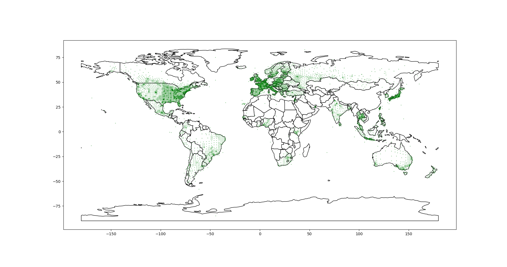
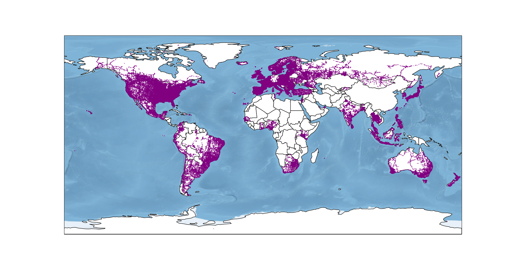
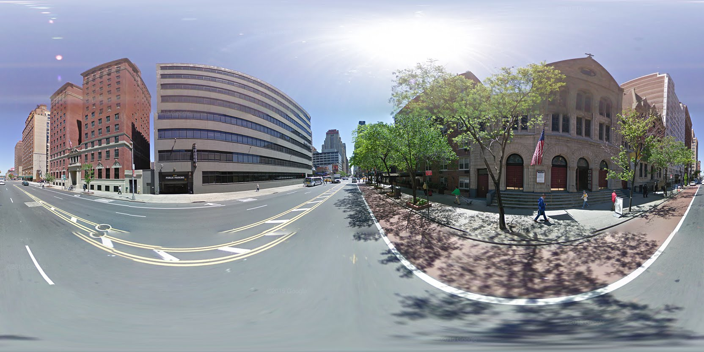

# geoguessr-ai
ML project revolving around guessing position by looking at street view image. 

### Approach
- Download as many street view images as possible, trim and compress
- Create classes using S2 library  Used similar parition technique as this paper: https://research.google.com/pubs/archive/45488.pdf 

- Split dataset into classes, try to get balanced datasets
- Download a lot more of street view images for small classes, islands, cities and alike (not everything is on google street view as you can see): 

- Example image 
- Train ResNet-50 with pretrained weights (changed first and last layer to accomodate input and output) using automated script that deploy code and train on https://runpod.io
- Run, test, repeat training. Add well-known augmentations, custom augmentation (PanoramaShifting), more trimming, lower resolution etc.
- Used GradCamPlusPlus (check_net.py) to see what ResNet is looking at to make it's decisions  

- My best attempt (~geoguessr Master level) used "voting algorithm" on images from multiple years of street view

### Things I want to try
- Add multiple heads to guess country/continent and location
